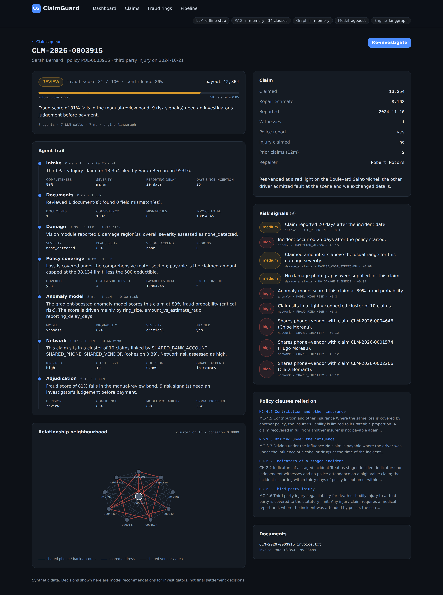
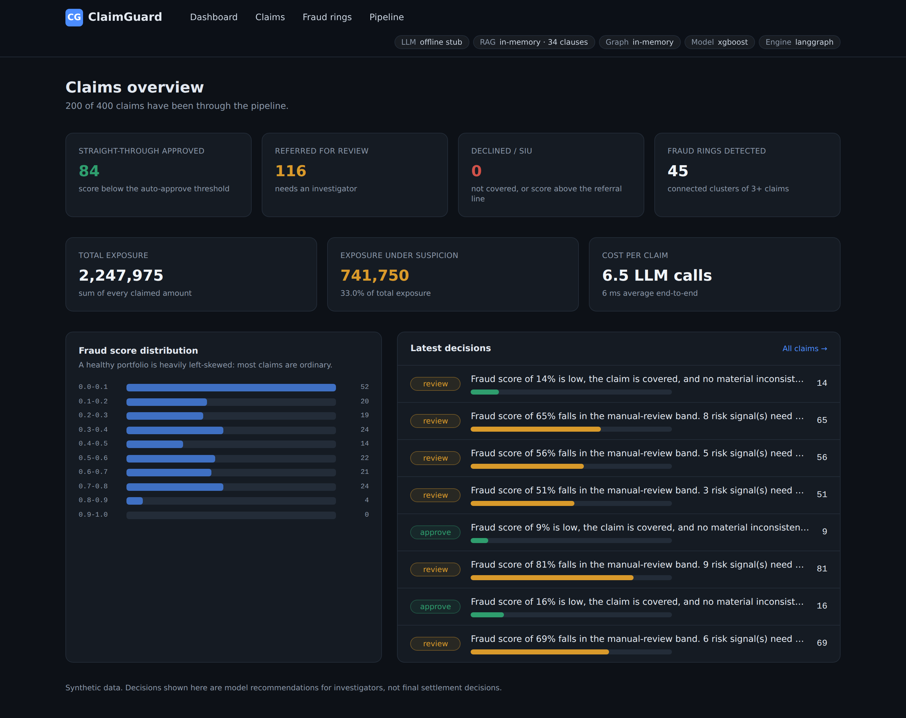
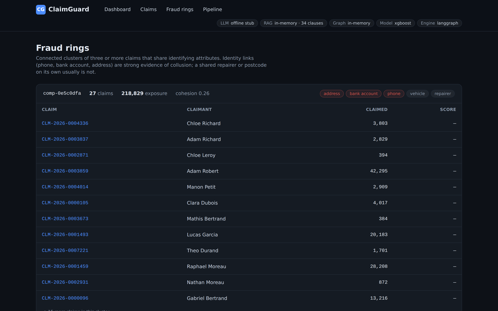
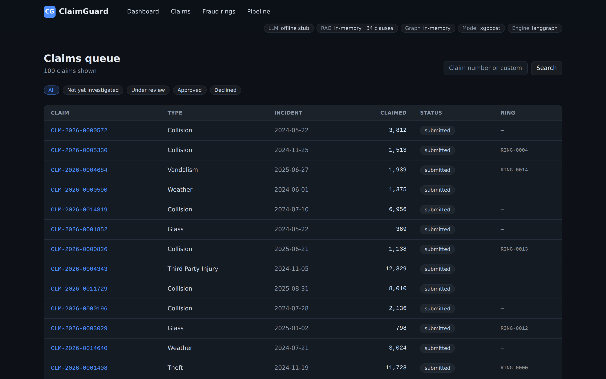
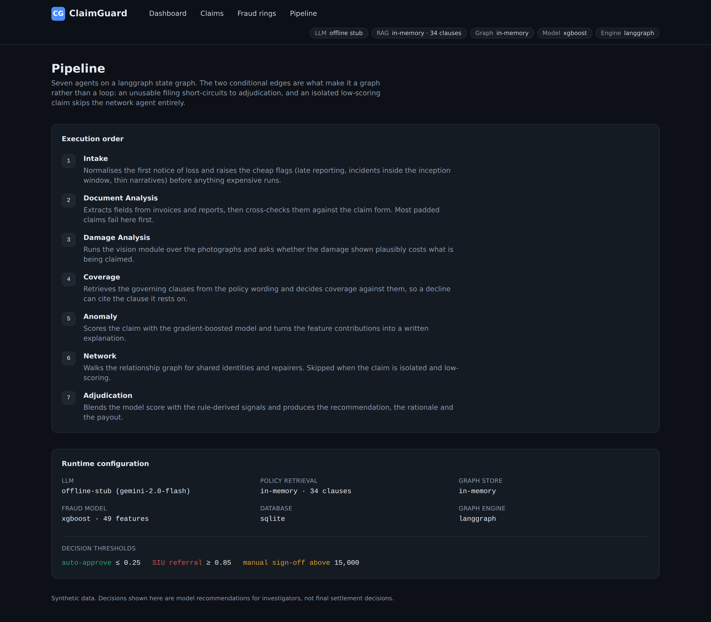

# ClaimGuard


Autonomous insurance claims investigation platform. A seven-agent pipeline reads a motor
claim, cross-checks the paperwork and photographs against the policy wording, scores it
against a supervised fraud model and a relationship graph, and returns an
**approve / review / reject** recommendation with the evidence behind it.

The point of the project is the *decision*, not the score. Every recommendation carries the
clause it rests on, the document fields that disagreed, the features that drove the model,
and the other claims it is connected to — because an insurer cannot decline a claim on a
number alone.

```
                       ┌──────────┐
   claim  ───────────► │  intake  │  normalise, validate, cheap flags
                       └────┬─────┘
                            │  (unusable filing short-circuits)
                            ▼
                 ┌──────────────────────┐
                 │  document analysis   │  invoice vs claim form
                 └──────────┬───────────┘
                            ▼
                 ┌──────────────────────┐
                 │   damage analysis    │  photographs vs claimed cost
                 └──────────┬───────────┘
                            ▼
                 ┌──────────────────────┐
                 │  policy coverage     │  RAG over the policy wording
                 └──────────┬───────────┘
                            ▼
                 ┌──────────────────────┐
                 │   anomaly model      │  XGBoost + feature attribution
                 └──────────┬───────────┘
                            │  (isolated, low-scoring claims skip ahead)
                            ▼
                 ┌──────────────────────┐
                 │   network analysis   │  fraud rings in the graph
                 └──────────┬───────────┘
                            ▼
                 ┌──────────────────────┐
                 │    adjudication      │  decision + rationale + payout
                 └──────────────────────┘
```

## What it looks like

Every recommendation opens as an evidence pack: the agent trail with each agent's
cost and conclusion, the risk signals with their weights, the policy clauses the
coverage decision cites, and the claim's neighbourhood in the relationship graph.



<table>
<tr>
<td width="50%"><br><sub><b>Dashboard</b> — decision mix, exposure under suspicion, score distribution, cost per claim.</sub></td>
<td width="50%"><br><sub><b>Fraud rings</b> — connected clusters, flagged by which attribute they share.</sub></td>
</tr>
<tr>
<td width="50%"><br><sub><b>Claims queue</b> — filterable by status, amount and claimant.</sub></td>
<td width="50%"><br><sub><b>Pipeline</b> — the seven agents, the live backends, the decision thresholds.</sub></td>
</tr>
</table>

> The seeded demo portfolio is deliberately fraud-heavy (~39%, because seeding
> over-samples ring members so the graph views have something to show). On that
> mix the end-to-end pipeline flags 94% of the labelled fraud at 59% precision.
> That is a demo seed, not a benchmark — the honest model numbers come from
> `ml/evaluate.py` on the held-out split.

## Runs with nothing installed

Every external dependency has an offline fallback, and the API reports which one is live at
`/api/system/info` (the dashboard shows it as a row of chips, so it is never ambiguous
whether you are looking at real or offline output).

| Subsystem | Production backend | Offline fallback |
|---|---|---|
| Reasoning | Gemini | deterministic rule-based reasoner, same JSON contract |
| Policy retrieval | Qdrant + sentence-transformers | in-memory cosine index + hashed embeddings |
| Relationship graph | Neo4j | NetworkX, built from the relational store |
| Fraud model | trained XGBoost | explainable logistic scorecard |
| Damage analysis | YOLOv8 | OpenCV heuristics, then image statistics |
| Documents | Tesseract / pdfminer | regex extraction over plain text |
| Database | PostgreSQL | SQLite |
| Orchestration | LangGraph | built-in runner with identical topology |

## Quick start

```bash
pip install -r requirements.txt

python scripts/seed_db.py --claims 400 --reset   # database + sample claims
python scripts/run_demo.py --limit 25            # run the pipeline, print results

uvicorn app.main:app --reload --app-dir backend  # API on :8000, docs at /docs
cd frontend && npm install && npm run dev        # dashboard on :3000
```

Or `make seed`, `make demo`, `make api`, `make web`.

## Training the fraud model

The repo ships without model weights; the platform cold-starts on the scorecard and upgrades
itself the moment an artifact appears.

```bash
python ml/generate_dataset.py --claims 150000 --rings 120   # ~1 min
python ml/train_graphsage.py                                # claim embeddings
python ml/train_xgboost.py --embeddings artifacts/graphsage_embeddings.npz
python ml/evaluate.py                                       # the ablation table
```

`ml/evaluate.py` trains the same model three ways on the same time-based split and prints
one table: base features, plus graph features, plus GraphSAGE embeddings. **Quote the
numbers it prints.** They are the ones this repo reproduces, and an interviewer can rerun
them in two minutes.

### About the data

No public motor-insurance dataset ships with labelled organised fraud, so
`ml/generate_dataset.py` builds one: a freMTPL2-shaped population of French motor policies
(vehicle power and age, driver age, bonus-malus, region) with two fraud layers on top — an
individual layer whose signal is behavioural, and an organised layer of rings whose members
deliberately share phone numbers, bank accounts, addresses and repairers.

Three decisions in the generator matter, and they are the ones worth explaining out loud:

1. **The classes overlap on purpose.** 22% of fraudulent claims present as completely
   ordinary and 14% of genuine claims tick several suspicious boxes. Without that overlap
   the dataset is separable, the model hits ROC-AUC 1.0, and every metric measured on it is
   meaningless.
2. **Incident dates are drawn first and policy inception derived backwards.** Doing it the
   other way round pushes fraudulent claims towards the start of the calendar — they sit
   closer to inception — and a time-based split then puts almost no fraud in the test fold.
3. **The split is time-based, not random.** A random split leaks ring structure across the
   boundary: members of the same ring land on both sides and the model looks far better than
   it is.

## Layout

```
backend/app/
  agents/        seven agents + the LangGraph state machine
  services/      llm, vectorstore, graphstore, ml, vision, documents, features
  api/routes/    claims, investigations, graph, system
  models/        SQLAlchemy schema (claims, investigations, agent runs)
ml/              dataset generator, XGBoost, GraphSAGE, evaluation
data/policies/   the policy wording the RAG layer retrieves from
frontend/        Next.js dashboard (claims, claim detail, rings, pipeline)
scripts/         seed_db.py, run_demo.py
tests/           pipeline and API tests
```

## How the score is built

```
fraud_score = 0.65 × model_probability + 0.35 × signal_pressure
```

`signal_pressure` is the summed weight of every signal the agents raised, squashed into
0–1. It is linear on purpose: an investigator can reconstruct the score by hand from the
signal list, which matters when a decline is disputed. Two guardrails sit above the LLM and
cannot be overridden by it — an uncovered loss is never approved, and a claim above the
high-value ceiling never auto-approves regardless of score.

## API

| Endpoint | What it does |
|---|---|
| `GET /api/claims` | queue, filterable by status, amount, claimant |
| `GET /api/claims/{id}` | claim, documents, latest investigation |
| `POST /api/claims/{id}/investigate` | run the pipeline |
| `POST /api/claims/{id}/documents` | upload invoices / photographs |
| `POST /api/investigations/batch` | process the queue |
| `GET /api/graph/rings` | detected fraud rings |
| `GET /api/graph/claims/{id}` | a claim's neighbourhood, for the graph view |
| `GET /api/stats` | portfolio metrics |
| `GET /api/system/info` | which backend each subsystem is running on |

Interactive docs at `/docs`.

## Tests

```bash
pytest -q
```

Covers feature-vector stability, the scorecard's ordering, ring detection (including that a
busy garage with forty customers does *not* become a ring), invoice extraction, clause
parsing, the score blend, both conditional routes, and the full API path end to end.

## Regenerating the screenshots

With both servers running:

```bash
python scripts/capture_screenshots.py    # writes docs/images/*.png
```

## Notes

Synthetic data throughout; no real claimant data is used anywhere. Decisions the platform
produces are recommendations for a human investigator, not settlement decisions.

Further reading: [`docs/ARCHITECTURE.md`](docs/ARCHITECTURE.md) for how the pieces fit
together, and [`docs/INTERVIEW_NOTES.md`](docs/INTERVIEW_NOTES.md) for the design decisions
and the bugs found along the way.

## License

MIT — see [LICENSE](LICENSE).
